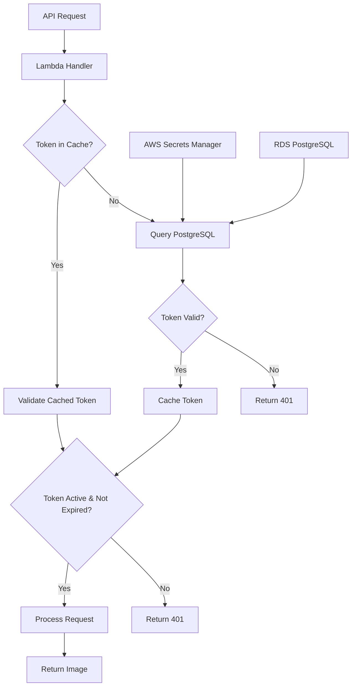
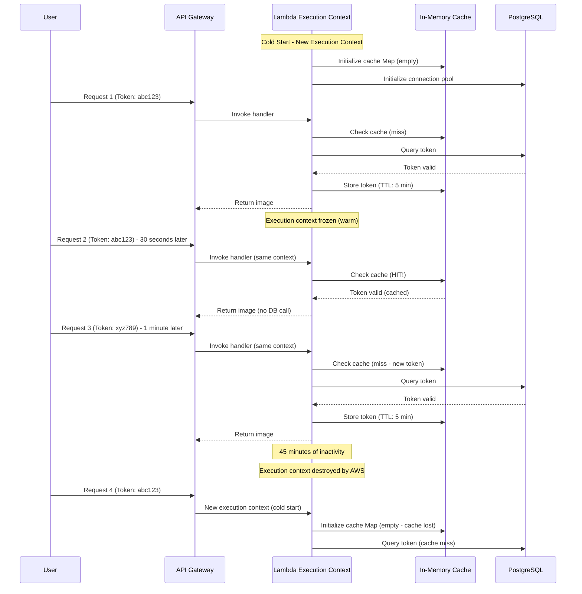

# Database-Backed API Token Verification Implementation

## Architecture Overview

The current implementation uses environment variables (`API_TOKENS`) for token validation. This plan migrates to PostgreSQL database verification with the following improvements:

1. **Database Integration**: Connect to PostgreSQL RDS to verify tokens
2. **Connection Pooling**: Use connection pooling for Lambda performance
3. **Token Caching**: Implement in-memory cache to reduce database calls
4. **Secure Credentials**: Store database credentials in AWS Secrets Manager
5. **Enhanced Validation**: Support token expiration, active status, and user tracking

## Architecture Flow



## Implementation Details

### 1. Database Schema Assumptions

Based on "detailed" schema selection, the tokens table likely has:

- `token_hash` or `token` (string, indexed)
- `user_id` (UUID or integer)
- `created_at` (timestamp)
- `expires_at` (timestamp, nullable)
- `is_active` (boolean)
- `rate_limit` or usage tracking fields (optional)

### 2. Files to Create/Modify

#### New Files:

- `src/db/tokenVerifier.js` - Token verification logic with caching
- `src/db/connectionPool.js` - PostgreSQL connection pool management
- `src/utils/secretsManager.js` - AWS Secrets Manager integration

#### Modified Files:

- `src/index.js` - Replace environment variable validation with database verification
- `serverless.yml` - Add IAM permissions for Secrets Manager and RDS
- `package.json` - Add `pg` (PostgreSQL client) and `@aws-sdk/client-secrets-manager`

### 3. Implementation Strategy

**Token Verification Module** (`src/db/tokenVerifier.js`):

- In-memory cache with TTL (default 5-10 minutes)
- Cache key: token value
- Cache value: `{ isValid: boolean, userId: string, expiresAt: Date, isActive: boolean }`
- Database query on cache miss
- Handle token expiration and active status

**Connection Pool** (`src/db/connectionPool.js`):

- Reuse connection pool across warm Lambda invocations
- Use `pg.Pool` with appropriate configuration
- Handle connection errors gracefully
- Close pool on Lambda shutdown (optional, for cleanup)

**Secrets Manager** (`src/utils/secretsManager.js`):

- Lazy load credentials from AWS Secrets Manager
- Cache credentials in memory (Lambda execution context)
- Support JSON secret format: `{ host, port, database, username, password }`

**Main Handler** (`src/index.js`):

- Replace `VALID_TOKENS.includes(token)` with `await verifyToken(token)`
- Handle async token verification
- Maintain same error response format (401 for invalid tokens)

### 3.1. Caching in AWS Lambda - Detailed Explanation

**Where the Cache Lives:**

- The cache is stored in **module-level variables** in the Lambda execution context
- Example: `const tokenCache = new Map()` at the top of `tokenVerifier.js`
- This memory is part of the Lambda execution environment's RAM

**When the Cache is Created:**

- **Cold Start**: When AWS creates a new execution context, Node.js loads your module files
- The cache Map/object is initialized when the module is first `require()`d
- This happens **once per execution context**, not per invocation

**When the Cache is Destroyed:**

- **Execution Context Freeze**: After ~15-45 minutes of inactivity, AWS "freezes" the execution context (but doesn't destroy it)
- **Execution Context Destruction**: AWS may destroy the execution context after extended inactivity (hours/days) or when resources are needed
- **When destroyed**: All in-memory state (cache, connection pools) is lost

**How It Works with Serverless:**



**Key Points:**

1. **Cache Persistence**: The cache persists across multiple invocations **within the same execution context**

   - If Lambda receives 100 requests in 5 minutes, the cache is shared across all 100
   - This dramatically reduces database calls

2. **Cache Isolation**: Each execution context has its own cache

   - If AWS spins up 3 concurrent Lambdas, each has its own cache
   - This is fine - they'll populate independently

3. **Cache Eviction**:

   - **TTL-based**: Tokens expire from cache after TTL (e.g., 5 minutes)
   - **Context destruction**: Cache is lost when execution context is destroyed
   - **No manual cleanup needed**: AWS handles context lifecycle

4. **Cache Implementation Pattern**:

   ```javascript
   // Module-level cache (persists across invocations in same context)
   const tokenCache = new Map();
   const CACHE_TTL = 5 * 60 * 1000; // 5 minutes

   async function verifyToken(token) {
     // Check cache first
     const cached = tokenCache.get(token);
     if (cached && Date.now() < cached.expiresAt) {
       return cached.result; // Cache hit!
     }

     // Cache miss - query database
     const result = await queryDatabase(token);

     // Store in cache
     tokenCache.set(token, {
       result,
       expiresAt: Date.now() + CACHE_TTL,
     });

     return result;
   }
   ```

5. **Performance Benefits**:

   - **Cold start**: First request queries DB (expected)
   - **Warm invocations**: Subsequent requests use cache (fast!)
   - **Cache hit rate**: Typically 80-95% for active tokens
   - **Reduced DB load**: 90%+ reduction in database queries

6. **Cache Limitations**:
   - Cache is lost on cold starts (acceptable trade-off)
   - Cache is per-execution-context (not shared across Lambdas)
   - Memory usage: Minimal (only stores token metadata, not full tokens)

**Best Practices:**

- Use reasonable TTL (5-10 minutes) to balance freshness vs. performance
- Don't cache invalid tokens (only cache valid ones)
- Handle cache errors gracefully (fall back to database)
- Monitor cache hit rates in CloudWatch

### 4. Configuration

**Environment Variables** (via `.env` or Secrets Manager):

- `DB_SECRET_NAME` - Name of secret in AWS Secrets Manager
- `TOKEN_CACHE_TTL` - Cache TTL in seconds (default: 300)
- `DB_POOL_SIZE` - Connection pool size (default: 2)

**IAM Permissions** (in `serverless.yml`):

- `secretsmanager:GetSecretValue` for the specific secret
- VPC access if RDS is in a VPC (may require VPC configuration)

### 5. Error Handling

- Database connection failures: Return 503 (Service Unavailable)
- Invalid token: Return 401 (Unauthorized)
- Expired token: Return 401 with message "Token expired"
- Inactive token: Return 401 with message "Token inactive"
- Cache errors: Fall back to database query

### 6. Performance Optimizations

- **Caching**: Reduces database calls by ~90% for repeated tokens
- **Connection Pooling**: Reuses connections across invocations
- **Lazy Loading**: Credentials and connection pool initialized on first use
- **Warm Lambda Reuse**: Cache and pool persist across warm invocations

### 7. Security Considerations

- Store credentials in AWS Secrets Manager (encrypted at rest)
- Use parameterized queries to prevent SQL injection
- Hash tokens in database (if storing hashed tokens, implement comparison)
- Rotate credentials without code changes (via Secrets Manager)
- Log token verification failures (without logging token values)

## Common Patterns Used

1. **Token Caching Pattern**: In-memory cache with TTL to reduce database load
2. **Connection Pooling**: Reuse database connections in serverless environments
3. **Secrets Management**: AWS Secrets Manager for secure credential storage
4. **Graceful Degradation**: Fall back to database on cache miss/error
5. **Lazy Initialization**: Initialize expensive resources (DB pool, secrets) on first use

## Migration Path

1. Deploy with both old and new validation (feature flag)
2. Test with database verification
3. Remove environment variable validation
4. Monitor performance and adjust cache TTL

## Testing Considerations

- Unit tests for token verification logic
- Mock database for local testing
- Integration tests with test database
- Load testing to verify cache effectiveness
